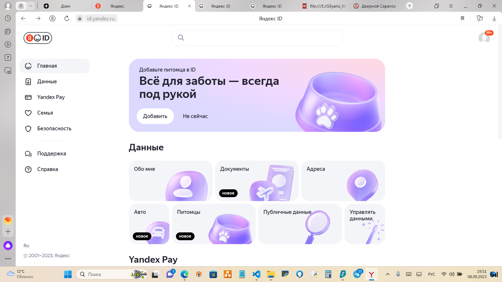

На основе сайта yandex.ru:
● Определите, на каком протоколе работает сайт.

**Ответ: Сайт работает по протоколу HTTPS. Дата выдачи 26 марта 2023 г.**

● Проанализируйте структуру страницы сайта

**Сайт состоит из 3 блоков**
## 1 Блок Header

## 2 Блок Content

## 3 Блок Footer

● Внесите не менее 10 изменений на страницу с помощью инструмента разработчика и представьте скриншоты 
было/стало.
**Так выглядит оригинал личной страницы и оригинал**

**Изменение 1- удаление Поиска**

**Изменения 2- изменена конфигурация Footer**

**Изменение 3 - изменена кнопка личного аккаунта**

 **Изменение 4- изменение надписи в кнопе Поиск**

**Изменение 5 B 6 - цветвой гаммы**

**Изменение 7 и 8- изменение название города и расположения данных о погоде и курсе валют**

**Изменение 9 и 10 - удаление значков почты и личного кабинета**

● Создайте прототип низкой детализации.
**Прототип низкой детализации**

